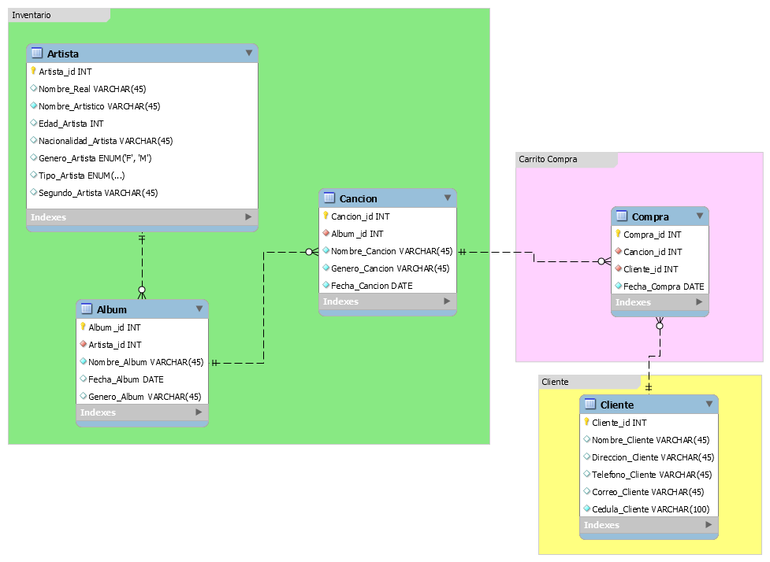

# TiendaV4
Tienda de canciones básica en Java con JPA y servicios REST que se diseño para un proyecto de integración en Ingeniería de Software 2.

## Tabla de Contenidos ##
- [Requerimientos](#Requerimientos)
- [Funcionalidad](#Funcionalidad)
- [Base de Datos](#Base-de-Datos)
- [Colaboradores](#Colaboradores)

## Requerimientos ##
- Eclipselink
- MySQL Connector

## Funcionalidad ##
En terminos generales la aplicación permite realizar lo siguiente:
- Crear Canciones, Albumes y Artistas
- Crear Usuarios
- Realizar compra de canciones
- Realizar compra de almbumes
- Tiene dos servicios expuestos para ser consumidos, los cuales permiten agregar canciones la base de datos o devolver la lista de canciones mas compradas.

## Base de Datos ##
La base de datos diseñada es batante sencilla y se divide en tres componentes principales:
- Inventario: Es el que contiene toda la tablas relacionadas con su Artista, Canción y Album.
- Carrito de Compra: Solo contiene una tabla que permite relacioanar las compras del cliente con la canción.
- Cliente: Tabla que representa al que realiza las compras.

## Colaboradores ##
- [Steven Puerto](https://github.com/stevenn2012)
- [Felix Moreno](https://github.com/Felixmorenot17)
- [Juliana Diaz](https://github.com/julidr)
